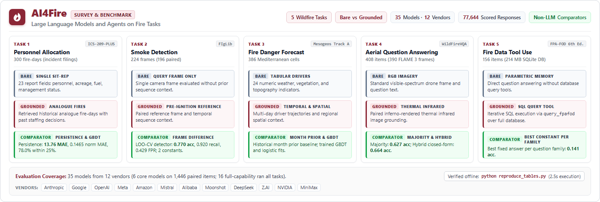
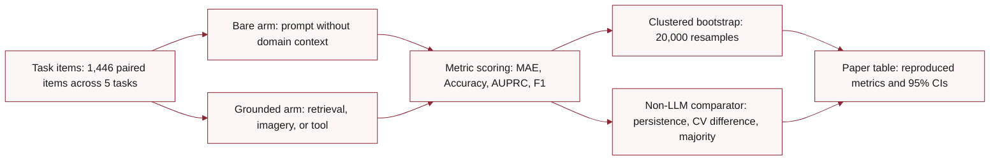

<a id="readme-top"></a>

<div align="center">

# AI4Fire

**Do language models and agents actually help on wildfire work, and does grounding them change the answer?**

Five wildfire tasks that score without a human in the loop. Every model runs twice, bare and grounded, and every task is scored beside a non-LLM comparator. The prompts, the raw responses, and the scripts that turn them into the paper's tables are all here.

[](LICENSE)
[](https://pypi.org/project/ai4fire/)
[](#reference)
[](#why-youd-use-this)
[](#quickstart)
[](https://github.com/yzhao062/AI4Fire)

[Quickstart](#quickstart) &nbsp;•&nbsp;
[Why](#why-youd-use-this) &nbsp;•&nbsp;
[How It Works](#how-it-works) &nbsp;•&nbsp;
[Examples](#what-this-looks-like) &nbsp;•&nbsp;
[Tasks](#the-five-tasks) &nbsp;•&nbsp;
[Data and Licensing](#reference)

</div>



> [!NOTE]
> **The full execution record behind the paper.** Every prompt, item manifest, raw model response, item score, and analysis script behind the paper *AI4Fire: Large Language Models and Agents on Fire Tasks* is in this repository. One command rebuilds all five task tables from the stored responses, offline, with no credentials. Maintained by [Yue Zhao](https://yzhao062.github.io), USC CS faculty and author of [PyOD](https://github.com/yzhao062/pyod) (9.8k★ · 38M+ downloads · ~12k citations), with Xiyang Hu (ASU) and Ruolin Li (USC).

## Quickstart

```bash
git clone https://github.com/yzhao062/AI4Fire.git
cd AI4Fire
pip install -r requirements.txt
python reproduce_tables.py
```

That rebuilds every primary table in the paper from the stored responses. It reads only tracked
files, needs no API key and no network, and exits non-zero if any expected model-arm is missing.

> [!TIP]
> `pip install ai4fire` installs the task inventory alone, as a `TASKS` tuple and an `ai4fire`
> command. It is for looking up what the five tasks are without a clone; running the benchmark
> still needs this repository.

## Why You'd Use This

**You want to know whether a model beats doing nothing.** A leaderboard tells you which model
ranks first, and nothing about whether first place is any good. Every task here is scored beside
a non-LLM comparator. Allocation has persistence; fire danger has a calendar-month prior and a
temperature rule; aerial questions have a held-out majority and a closed-form thermal rule. Tool
use has a best-constant baseline, and smoke detection has two constants beside a frame-difference
detector. Zero-shot prompted frontier models rarely clear that floor.

**You are adding context to a model and want to know if it helps.** Grounding is usually reported
as one average effect, and that average hides the thing worth knowing. Five interventions here
each move their own task in their own direction. A reference frame raises smoke recall on every
model. Retrieved analogues raise allocation error on most of them. Monthly climatology lowers
fire-danger ranking on five of the six core models, and a thermal summary block lifts the items
it answers while lowering the rest. A read-only SQL tool lifts every model from at most 0.16 to 0.88 or above. Whether the added
material contains the answer does not predict the sign.

**You need an evaluation you can rerun without paying for inference.** Every one of the 77,644
scored responses is stored in the repository. Rescoring, reanalysis, and every figure run from
those files. A checksum manifest catches drift.

**You are building a benchmark and want the failure modes already catalogued.** Re-deriving each
public source turned up three hazards. One column separates the fire-danger holdout at average
precision 1.000. Several question types are answerable from a released metadata field by a
closed-form rule. One question family hands the model its own SQL predicates in the wording of
the question. Each is documented beside the check that found it.

## How It Works

Every task ships a fixed item manifest. Each model answers every item twice: once from the task
prompt alone, and once with that task's grounding material added. Both arms are scored by exact
match or numeric comparison against the released answer, never by a judge model. Uncertainty comes
from a bootstrap clustered on whatever unit the task's items actually depend on. That unit is
fires for smoke detection, incidents for allocation, spatial blocks by month for fire danger,
question families for tool use, and frames for aerial questions.

Two design choices are worth naming before you read any number. The five grounding interventions
are not comparable to each other, because each appears on exactly one task. Results are therefore
task-conditional, and no single average grounding effect exists to report. Comparators are part
of the protocol, which is what makes a flat result interpretable.

## The Five Tasks

Every task scores without a human in the loop, against a released answer key.

| Task | Source | Items | Grounding Added | Non-LLM Comparator |
|---|---|---|---|---|
| Daily personnel allocation | ICS-209-PLUS (St. Denis et al., 2023) | 300 fire-days | Retrieved analogues | Persistence, trained regressor |
| Wildfire smoke detection | FIgLib (HPWREN, UC San Diego) | 224 frames, 196 paired | Reference frame | Two constants, frame-difference detector |
| Fire danger forecasting | Mesogeos Track A (Kondylatos et al., 2023) | 386 cells | Monthly climatology | Calendar-month prior, temperature rule, trained classifier |
| Temperature-grounded aerial QA | WildFireVQA (Habibpour et al., 2026) over FLAME 3 | 408 items, 390 frames | Thermal summary block | Held-out majority, closed-form thermal rule |
| Fire data tool use | FPA-FOD 6th edition (Short, 2022) | 156 items | Read-only SQL tool | Best constant per family |

Sources, licenses, and what is withheld are in [Reference](#reference).

## What This Looks Like

### Evaluation Pipeline

The diagram below traces each evaluation item through bare and grounded model arms, scoring, non-LLM comparators, and cluster bootstrapping to the final paper tables.



### What a Clone Contains

An annotated directory tree below highlights the primary task data, recorded model completions, analysis harnesses, and reproduction entry points.

```text
AI4Fire/
├── task-*/                     # Five wildfire tasks: items, prompt manifests, and recorded outputs
│   ├── items.jsonl             # Scored item instances with labels, context, and split assignments
│   ├── responses-*.jsonl       # Tracked model completions, usage stats, and parsed answers
│   └── scores.json             # Evaluated metrics for bare, grounded, and tool-augmented arms
├── analysis/                   # Statistical analysis, bootstrap uncertainty, and comparators
│   ├── figlib_baseline.py      # Non-LLM smoke detectors: constants and LOFO frame difference
│   ├── cluster_uncertainty.py  # 20,000-draw cluster bootstrap confidence intervals
│   ├── tooluse_paired.py       # Paired tool-minus-bare contrasts and SQL failure analysis
│   └── .analogue-pool-cache.json # Shipped analogue cache for offline allocation evaluation
├── figures/                    # Publication figure generation from tracked response files
│   ├── make_grounding_effects.py # Figure 3: grounding effects across tasks with 95% CIs
│   └── figstyle.py             # Shared color palette, font sizing, and export settings
├── baselines/                  # Trained non-LLM comparator models (boosted trees, regressors)
├── tests/                      # Verification suite: tool-use harness and adapter tests
├── reproduce_tables.py         # Offline reproduction of all five paper tables in 2.5 seconds
├── build_manifest.py           # Cryptographic integrity checker across 352 tracked artifacts
├── models.py                   # Registry of 35 models across 12 vendors, tiers, and token caps
└── gw.py                       # Unified calling gateway for NAIRR endpoints and Bedrock models
```

### Offline Table Reproduction

This terminal capture shows `python reproduce_tables.py` verifying stored model responses and reproducing primary paper tables in 2.5 seconds without network calls.

```console
$ python reproduce_tables.py
============================================================================================
 AI4FIRE BENCHMARK RESULTS REPRODUCTION (Tier: CORE, Models: 6)
 Verified against tracked responses-*.jsonl files
============================================================================================

============================================================================================
 TASK 1: DAILY PERSONNEL ALLOCATION (ICS-209-PLUS, 300 items)
============================================================================================
Model                      Condition       MAE   Norm MAE   Within 25%  Beats Persist
--------------------------------------------------------------------------------------------
Persistence (comparator)   --            13.76     0.1465        0.780             --
--------------------------------------------------------------------------------------------
claude-opus-4.8            bare          14.31     0.1568        0.813          0.290
claude-opus-4.8            grounded      15.28     0.1701        0.780          0.287
claude-opus-5              bare          15.12     0.1654        0.797          0.333
claude-opus-5              grounded      14.52     0.1730        0.763          0.317
... [8 model-arms omitted: gemini-3.1-pro, gpt-6-astra, Qwen3-VL, Llama 4 Maverick] ...

============================================================================================
 TASK 2: WILDFIRE SMOKE DETECTION (FIgLib, 196 paired items)
============================================================================================
Model                      Condition    Accuracy     Recall        FPR   Sequences Detected
--------------------------------------------------------------------------------------------
claude-opus-4.8            bare            0.745      0.554      0.000             23 of 28
claude-opus-4.8            grounded        0.781      0.616      0.000             23 of 28
gemini-3.1-pro             bare            0.740      0.545      0.000             23 of 28
gemini-3.1-pro             grounded        0.837      0.732      0.024             26 of 28
gpt-6-astra                bare            0.786      0.643      0.024             24 of 28
gpt-6-astra                grounded        0.832      0.741      0.048             26 of 28
... [6 model-arms omitted: claude-opus-5, Qwen3-VL, Llama 4 Maverick] ...

... [Tasks 3 and 4 omitted: Fire Danger Forecasting (386 items), Aerial QA (408 items)] ...

============================================================================================
 TASK 5: FIRE DATA TOOL USE (FPA-FOD, 156 items)
============================================================================================
Model                      Condition    Accuracy    Abstained   Mean Calls
--------------------------------------------------------------------------------------------
claude-opus-4.8            bare            0.103           99         0.00
claude-opus-4.8            tool            1.000            0         1.13
claude-opus-5              bare            0.160           35         0.00
claude-opus-5              tool            1.000            0         1.17
gemini-3.1-pro             bare            0.160           59         0.00
gemini-3.1-pro             tool            1.000            0         1.62
... [6 model-arms omitted: gpt-6-astra, Qwen3-VL, Llama 4 Maverick] ...

 Coverage: 60 expected model-arms present with stored responses.

============================================================================================
 ALL PRIMARY NUMBERS REPRODUCED AND VERIFIED SUCCESSFULLY FROM STORED RESPONSES.
============================================================================================
```

### Smoke Detection Baseline Comparison

Reported below are smoke detection results across 196 paired frames, comparing three non-LLM comparators against three core models under bare and grounded conditions.

| Evaluated System | Condition | Accuracy | Recall (Smoke) | False Positive Rate | Sequences Detected |
|---|---|---:|---:|---:|---:|
| Always clear (constant) | Baseline | 0.429 | 0.000 | 0.000 | 0 of 28 |
| Always smoke (majority) | Baseline | 0.571 | 1.000 | 1.000 | 28 of 28 |
| Frame difference (LOFO) | Pixel diff | 0.770 | 0.920 | 0.429 | 28 of 28 |
| claude-opus-5 | Bare | 0.770 | 0.607 | 0.012 | 24 of 28 |
| claude-opus-5 | Grounded | 0.781 | 0.643 | 0.036 | 24 of 28 |
| gemini-3.1-pro | Bare | 0.740 | 0.545 | 0.000 | 23 of 28 |
| gemini-3.1-pro | Grounded | 0.837 | 0.732 | 0.024 | 26 of 28 |
| gpt-6-astra | Bare | 0.786 | 0.643 | 0.024 | 24 of 28 |
| gpt-6-astra | Grounded | 0.832 | 0.741 | 0.048 | 26 of 28 |

These metrics separate detection sensitivity from false alarm suppression. The leave-one-fire-out frame difference detector identifies 92.0% of smoke frames, exceeding all evaluated models on raw recall. It triggers false alarms on 42.9% of clear scenes. A constant always-smoke baseline achieves 1.000 recall while failing completely on clear scenes with a 1.000 false-positive rate. Models sit at the other end. Bare arms hold false positives between 0.000 and 0.024 while missing roughly 36 to 46 percent of plumes. A reference frame raises recall to between 0.643 and 0.741 with false positives still below 0.05. On overall accuracy the two approaches are not separated: every core model's paired interval against the detector spans zero, with margins running from -0.061 to +0.066.

## Running Your Own Model

Reproducing the tables needs nothing but this repository. Running a *new* model needs credentials
and network access.

Gateway models read two environment variables. `NAIRR_GATEWAY_URL` is the gateway base URL, and
`NAIRR_GATEWAY_KEY` is its bearer key. A run that needs the gateway without them fails with a
message naming the missing variable rather than falling back to a host baked into the source.
Bedrock models use the standard AWS credential chain or `AWS_BEARER_TOKEN_BEDROCK`. No key and no
endpoint appears anywhere in this repository or in any tracked log.

A model name carrying the `bedrock:` prefix goes through Bedrock; any other name goes through the
gateway.

| Command | What It Runs |
|---|---|
| `python run_all.py gpt-6-astra` | All three text and vision tasks, one after another |
| `python run_all.py --workers 2 bedrock:qwen.qwen3-vl-235b-a22b` | The same, with the worker count set before the model names |
| `python run_allocation.py --models claude-opus-5 claude-opus-4.8` | Daily personnel allocation only |
| `python run_figlib.py --models gemini-3.1-pro --workers 2` | Wildfire smoke detection only |
| `python run_mesogeos.py --models bedrock:qwen.qwen3-vl-235b-a22b` | Fire danger forecasting only |
| `python requery_figlib_item.py gpt-6-astra bare <item_id>` | Re-query one item after a transport error |

Each runner rewrites a condition's response file once, at the end of that condition. A run that
dies leaves the previous files intact and loses everything since the last write. Rerunning one
condition leaves the other file older, which trips the 60-minute skew guard in the pairing check.

## Reference

<details>
<summary><b>Evaluated Models and Serving Configurations</b></summary>

### Evaluated Models and Inference Settings

The six reported core models are `claude-opus-5`, `claude-opus-4.8`, `gemini-3.1-pro`, and `gpt-6-astra` through one gateway, alongside `Qwen3-VL-235B-A22B` and `Llama 4 Maverick` through Amazon Bedrock. The model sweep of 2026-09-18 added 29 Bedrock models across two groups. These models were selected via a capability probe (`probe_bedrock_caps.py`; results in `probes/bedrock-caps-2026-09-18.json`). Ten models that accept images and tools ran all five tasks. Of the nineteen text-only models, seventeen ran the three text tasks, and the two whose tool probe failed ran allocation and fire danger only.

The paired analyses, calibration analysis, sweep tables, and model figures read the registry `models.py`. Its tiers are `core`, `added`, `all`, `full`, `text`, and `every`. Here `all` and its alias `full` select the sixteen full-capability models, while `every` selects all 35. Legacy cluster and table scripts keep their own file discovery or manifest rules. The document `docs/MODEL-SWEEP-2026-09-18.md` records the probe, groups, pilots, launch scripts, and final outcomes.

| Model | Identifier (`gw.py`) | Vendor | Weights | Group | Tasks | Cap |
|---|---|---|---|---|---|---|
| claude-opus-4.8 | `claude-opus-4.8` | Anthropic | proprietary | reported six | all five | 1,536 |
| claude-opus-5 | `claude-opus-5` | Anthropic | proprietary | reported six | all five | 1,536 |
| gemini-3.1-pro | `gemini-3.1-pro` | Google | proprietary | reported six | all five | 1,536 |
| gpt-6-astra | `gpt-6-astra` | OpenAI | proprietary | reported six | all five | 1,536 |
| Nova Lite | `bedrock:amazon.nova-lite-v1:0` | Amazon | proprietary | added, full capability | all five | 1,536 |
| Nova Pro | `bedrock:amazon.nova-pro-v1:0` | Amazon | proprietary | added, full capability | all five | 1,536 |
| Nova 2 Lite | `bedrock:us.amazon.nova-2-lite-v1:0` | Amazon | proprietary | added, full capability | all five | 1,536 |
| Qwen3-VL | `bedrock:qwen.qwen3-vl-235b-a22b` | Alibaba | open | reported six | all five | 1,536 |
| Llama 4 Maverick | `bedrock:us.meta.llama4-maverick-17b-instruct-v1:0` | Meta | open | reported six | all five | 1,536 |
| Llama 4 Scout | `bedrock:us.meta.llama4-scout-17b-instruct-v1:0` | Meta | open | added, full capability | all five | 1,536 |
| Mistral Large 3 | `bedrock:mistral.mistral-large-3-675b-instruct` | Mistral | open | added, full capability | all five | 1,536 |
| Ministral 3 8B | `bedrock:mistral.ministral-3-8b-instruct` | Mistral | open | added, full capability | all five | 1,536 |
| Kimi K2.5 | `bedrock:moonshotai.kimi-k2.5` | Moonshot | open | added, full capability | all five | 1,536 |
| Gemma 3 27B | `bedrock:google.gemma-3-27b-it` | Google | open | added, full capability | all five | 1,536 |
| Gemma 3 12B | `bedrock:google.gemma-3-12b-it` | Google | open | added, full capability | all five | 1,536 |
| Gemma 3 4B | `bedrock:google.gemma-3-4b-it` | Google | open | added, full capability | all five | 1,536 |
| Nova Micro | `bedrock:amazon.nova-micro-v1:0` | Amazon | proprietary | text-only sweep | allocation, fire danger, tool use | 1,536 |
| Llama 3.3 70B | `bedrock:us.meta.llama3-3-70b-instruct-v1:0` | Meta | open | text-only sweep | allocation, fire danger, tool use | 1,536 |
| Llama 3.1 70B | `bedrock:us.meta.llama3-1-70b-instruct-v1:0` | Meta | open | text-only sweep | allocation, fire danger, tool use | 1,536 |
| Mistral Small 2402 | `bedrock:mistral.mistral-small-2402-v1:0` | Mistral | open | text-only sweep | allocation, fire danger, tool use | 1,536 |
| Devstral 2 123B | `bedrock:mistral.devstral-2-123b` | Mistral | open | text-only sweep | allocation, fire danger, tool use | 1,536 |
| Qwen3 32B | `bedrock:qwen.qwen3-32b-v1:0` | Alibaba | open | text-only sweep | allocation, fire danger, tool use | 1,536 |
| Qwen3 Next 80B | `bedrock:qwen.qwen3-next-80b-a3b` | Alibaba | open | text-only sweep | allocation, fire danger, tool use | 1,536 |
| Qwen3 Coder 30B | `bedrock:qwen.qwen3-coder-30b-a3b-v1:0` | Alibaba | open | text-only sweep | allocation, fire danger, tool use | 1,536 |
| DeepSeek V3.2 | `bedrock:deepseek.v3.2` | DeepSeek | open | text-only sweep | allocation, fire danger, tool use | 1,536 |
| GPT-OSS 120B | `bedrock:openai.gpt-oss-120b-1:0` | OpenAI | open | text-only sweep | allocation, fire danger, tool use | 1,536 |
| GPT-OSS 20B | `bedrock:openai.gpt-oss-20b-1:0` | OpenAI | open | text-only sweep | allocation, fire danger, tool use | 1,536 |
| GLM 5 | `bedrock:zai.glm-5` | Z.AI | open | text-only sweep | allocation, fire danger, tool use | 1,536 |
| GLM 4.7 | `bedrock:zai.glm-4.7` | Z.AI | open | text-only sweep | allocation, fire danger, tool use | 1,536 |
| GLM 4.7 Flash | `bedrock:zai.glm-4.7-flash` | Z.AI | open | text-only sweep | allocation, fire danger, tool use | 1,536 |
| MiniMax M2.5 | `bedrock:minimax.minimax-m2.5` | MiniMax | open | text-only sweep | allocation, fire danger, tool use | 8,192 |
| Kimi K2 Thinking | `bedrock:moonshot.kimi-k2-thinking` | Moonshot | open | text-only sweep | allocation, fire danger, tool use | 8,192 |
| Nemotron Super 3 120B | `bedrock:nvidia.nemotron-super-3-120b` | NVIDIA | open | text-only sweep | allocation, fire danger, tool use | 1,536 |
| Llama 3.1 8B | `bedrock:us.meta.llama3-1-8b-instruct-v1:0` | Meta | open | text-only sweep | allocation, fire danger | 1,536 |
| DeepSeek R1 | `bedrock:us.deepseek.r1-v1:0` | DeepSeek | open | text-only sweep | allocation, fire danger | 8,192 |

Every run uses the same prompts and the standard output cap of 1,536 tokens. The three reasoning models marked 8,192 are the exception. MiniMax M2.5 and Kimi K2 Thinking parsed 2 of 10 bare allocation pilot items at the standard cap, while DeepSeek R1 parsed 6. Their runs record the 8,192-token cap in `usage.max_out`. The file `models.py` records the configured cap of every model. Rows written before that field existed, the core six included, do not carry it.

All models ran at temperature zero except `gpt-6-astra`. Its endpoint accepts only its default temperature of 1 and takes the cap as `max_completion_tokens`, which counts reasoning tokens (`gw.py`). Its bare allocation repeat is under `repeat/`.

Gemma 3 on Bedrock does not use Converse tool blocks; it calls tools through Python calls in fenced `tool_code` blocks. The gateway script `gw.py` therefore renders tool declarations into the system prompt and parses call blocks from assistant turns (`parse_tool_code_fences`). The runner sees the same tool interface over a different wire protocol. Such rows carry `tool_protocol: "tool_code"` in the usage dictionary.

The full Llama 3.1 8B run supersedes its 10-item allocation probe of 2026-09-16. That probe verified the Bedrock credentials, and its rows remain in the history at commit 6e37924.

</details>

<details>
<summary><b>Repository Layout</b></summary>

### Repository Structure and Asset Locations

| Path | Description |
|---|---|
| `task-<name>/` | Task pools and evaluation sets: `items.jsonl` (full pool), `items-v1.jsonl` or `items-index.csv` (scored set), `responses-<model>-<condition>.jsonl` (raw text, parsed answer, usage, served model, and analogue IDs for grounded allocation), and `scores.json`. |
| `task-allocation/b4-rerun/` | The single grounded item re-queried after the round-2 review, alongside the rows it replaced. |
| `repeat/` | Repeat runs evaluated for run-to-run variation statistics. |
| `archive-2026-09-15-*/` | Earlier runs retained as evidence: the output-cap defect (`cap200`) and the initial analogue pool. |
| `logs/` | Runner logs. Root-level `run-*.log` and `.err` files record gateway runs. |
| `analysis/` | Statistical intervals, non-LLM comparators, item pairings, and failure audit scripts. |
| `figures/` | Paper data figures. Each `make_<name>.py` plots response files and analysis outputs, prints numbers beside paper values, and writes `<name>.pdf` and `.png`. `figstyle.py` defines shared palettes and type sizes. |
| `survey/` | Systematic literature survey: 138 kept works, 31 claim-by-claim re-checks, scoping summary, 34-source availability check, and Appendix A counting scripts. |
| `build_items_*.py` | Task builders. Automated downloaders (`fetch_*.py`) retrieve sources where redistribution permissions permit. |
| `match_flame3.py` | Maps each aerial question to its FLAME 3 frame by thermal fingerprint and renders thermal imagery. |
| `run_*.py` | Benchmark runners. The central gateway script `gw.py` is the only point where external models are called. |
| `models.py` | Central model registry: label, identifier, vendor, weights, serving path, tier, token cap, and tool support. |
| `probe_bedrock_caps.py` | Modality and tool probe behind Bedrock sweep groups; outputs are stored in `probes/`. |
| `run_tier1.ps1` | Detached five-task execution chain for added full-capability models (2026-09-18 sweep). |
| `run_tier2.ps1` | Throttled three-task execution chain for text-only models (`-Pilot` executes ten-item test batches). |
| `docs/` | The 2026-09-18 model sweep record, and the hero image with its source. |
| `tests/` | Pytest verification suite: tool-use harness tests against reference queries and the Gemma `tool_code` adapter. |

`data/` and the FIgLib frames under `task-figlib/images*` are not stored in this Git repository. Under its CC BY-NC-ND 4.0 license terms, the item manifest carries an exact `source_url` per frame and `build_items_figlib.py` re-downloads them. Automated downloaders `fetch_mesogeos.py` and `fetch_fpafod.py` download their respective sources. ICS-209-PLUS and the WildFireVQA question release are downloaded manually from the portals specified by the task builders.

`fetch_flame3.py` downloads the FLAME 3 computer-vision subset (Sycan Marsh) from its Kaggle mirror. It reads Kaggle API credentials from the environment or a local `.env` (`KAGGLE_USERNAME`, `KAGGLE_KEY`); the IEEE DataPort original requires an institutional login. Then `match_flame3.py` writes `task-wildfirevqa/image-map.json` and the inferno-rendered thermal images under `data/flame3/rendered/`.

</details>

<details>
<summary><b>Reproducibility Scripts and Baselines</b></summary>

### Detailed Analysis Scripts (Offline, No Raw Data Downloads)

The following scripts evaluate stored model responses without calling external models or requiring raw source downloads.

#### Task-Specific Scoring and Table Generation

| Command | Purpose |
|---|---|
| `python table_rows_allocation.py` | Allocation table: MAE, normalized error, split columns, within-25% share. |
| `python analyze_allocation_all.py` | Stable and moving days, false move, missed move, direction. |
| `python copy_agreement.py` | Measures how often a grounded prediction equals the displayed analogue rule. |
| `python score_mesogeos_all.py` | AUPRC, fire-class F1, call rate, omitted answers, per run. |
| `python repeat_stats.py` | Run-to-run variation across repeat runs. |
| `python table_rows_new_models.py --tier all` | Results tables for all sixteen full-capability models. |

#### Paired and Bootstrap Uncertainty Analyses

All paired and bootstrap uncertainty analyses use stable seed `20260915` and 20,000 resamples:

| Command | Purpose |
|---|---|
| `python analysis/figlib_paired.py` | Smoke detection paired analysis (196 common items). |
| `python analysis/tooluse_paired.py` | Tool use paired tool-minus-bare accuracy with 12-family bootstrap. |
| `python analysis/wildfirevqa_paired.py` | Aerial QA paired grounded-vs-bare with 390-frame bootstrap. |
| `python analysis/wildfirevqa_comparators.py` | Aerial models against majority and hybrid comparators. |
| `python analysis/calibration_mesogeos.py` | ECE, Brier score, Murphy reliability and resolution terms. |
| `python analysis/prompt_sensitivity.py` | Fire danger prompt paraphrases (`p1`, `p2`) against `p0`. |
| `python analysis/cluster_uncertainty.py --manifest manifest-v1.json` | 95% cluster bootstrap intervals across tasks, restricted to the 36 reported arms (about 45 seconds). Without the flag it audits all 35 models on disk, takes over three minutes, and reports cross-run skew warnings for the repaired allocation arms. |
| `python analysis/retrieval_v2.py` | Grounded runs under analogue rule v2 beside bare and rule v1. |
| `python analysis/answer_failures.py` | Unparseable or omitted answer counts by task and model. |
| `python analysis/served_models.py` | Audit of distinct `served_model` strings and timestamps. |
| `python analysis/figlib_baseline.py` | Non-LLM comparators for smoke detection (added 2026-09-19). |
| `python analysis/small_cluster_correction.py` | Finite-cluster degrees-of-freedom corrections for small-cluster tasks (added 2026-09-19). |

#### Integrity Checks and Tests

| Command | Purpose |
|---|---|
| `python build_manifest.py --check` | Verifies tracked files against SHA-256 hashes in `manifest-v1.json` (verifies 352 files). |
| `python -m pytest tests` | Tests the tool-use harness and the Gemma `tool_code` adapter. 27 tests; two of them skip unless the raw FPA-FOD database is present. |

#### Paper Figures

Each figure script prints numerical outputs beside paper values and writes `<name>.pdf` and `<name>.png`.

> [!IMPORTANT]
> Three of these read intermediate JSON that `analysis/` writes and `.gitignore` excludes, so they fail on a fresh clone until you generate it. Run `python analysis/figlib_paired.py`, `python analysis/tooluse_paired.py`, and `python analysis/wildfirevqa_paired.py` first. The other figure scripts read the tracked response files directly and need no such step.

| Command | Figure Description |
|---|---|
| `python figures/make_grounding_effects.py` | Grounded minus bare across four tasks with cluster confidence intervals. Needs `analysis/figlib-paired.json`. |
| `python figures/make_survey_landscape.py` | 138 kept literature works grouped by taxonomy category. |
| `python figures/make_allocation_analogues.py` | Analogue copy rates and next-day staffing ratios. |
| `python figures/make_figlib_timeline.py` | Smoke detection accuracy by minutes since plume. Needs `analysis/figlib-paired.json`. |
| `python figures/make_wildfirevqa.py` | Aerial question answering, grounded against bare. Needs `analysis/wildfirevqa_paired.json`. |
| `python figures/make_calibration.py` | Fire danger reliability diagrams versus month prior. |
| `python figures/make_prompt_sensitivity.py` | Stated probabilities under prompt paraphrases. |

*Note on offline execution*: `copy_agreement.py`, `analysis/retrieval_v2.py`, and `figures/make_allocation_analogues.py` use the precomputed analogue pool cache shipped at `analysis/.analogue-pool-cache.json`. This cache enables immediate offline execution without re-indexing the raw historical ICS-209-PLUS database.

### Scripts Requiring Raw Upstream Data

The following specialized scripts train new non-LLM baseline models or compute empirical priors from raw multi-year historical records. They require raw upstream data fetched into `data/` using the respective fetch scripts:

| Command | Purpose |
|---|---|
| `python month_prior.py` | Fits the calendar-month prior on the 2006-2019 training years, reading `positives.csv` and `negatives.csv` under `data/mesogeos/`. |
| `python analysis/information_only_baselines.py` | Fits historical persistence and climatology rules. |
| `python baselines/mesogeos_trained.py` | Trains boosted trees and logistic regression on raw Mesogeos drivers. |
| `python baselines/allocation_trained.py` | Trains boosted regressors on raw 30,869 ICS-209-PLUS fire-days. |

### Reported Runs and Manifest Verification

The 36 reported response files (three tasks x six models x two conditions) are listed in `manifest-v1.json` at the repository root. The manifest records their row counts, SHA-256 checksums, distinct `served_model` values, and serving pathways.

Evaluation scripts support a `--manifest manifest-v1.json` flag that restricts evaluation strictly to these reported files. This flag filters out exploratory probes and historic resolution arms (`analysis/cluster_uncertainty.py`, `analysis/answer_failures.py`, `analysis/figlib_paired.py`, `score_mesogeos_all.py`, `table_rows_allocation.py`, and `copy_agreement.py`). For `cluster_uncertainty.py`, the flag also silences the cross-run skew guard for the five grounded allocation pairs marked with `skew_override: true` from the analogue-date repair.

`build_manifest.py` regenerates the manifest from the repository tree. Membership, sections, and inclusion reasons come from the existing file. Row counts, checksums, served identifiers, and write times are recomputed. Beside the 36 reported files, it lists trained-baseline response files (`baselines`) and prompt-paraphrase runs (`prompt_variants`). It also lists rule-v2 grounded runs (`retrieval_v2`), alongside tool-use and aerial runs for every model (`tooluse`, `wildfirevqa`). The `added_models` and `text_models` sections record the 2026-09-18 sweep files on the other tasks, selected through tiers in `models.py`. Running `build_manifest.py --check` exits with code 1 if any recorded checksum differs from disk.

### Trained Baselines, Prompt Paraphrases, the Second Analogue Rule, and the Tool-Use Task

`baselines/mesogeos_trained.py` fits a histogram gradient-boosted classifier and a logistic regression on the 2006 to 2019 training years. It evaluates two feature sets. The prompt feature set contains the 121 numbers printed in the bare prompt at four significant figures. This includes the last six daily values, summary statistics per driver, static fields, and month. The script asserts the 386 evaluation rows against the item file. The full feature set includes all 30 daily values per driver at source precision. Learning rates and iteration counts are selected on 2020 data. Fits are evaluated on the 386 items and on the full 2021 to 2022 holdout. All resulting metrics are stored in `baselines/mesogeos_trained.json`.

`baselines/allocation_trained.py` fits a gradient-boosted regressor of the next-day personnel ratio (along with count and ridge variants) on 30,869 fire-days from 1,499 disjoint incidents. It reads the 23 report fields present in the bare prompt, selecting hyperparameters through incident-grouped five-fold cross-validation. Its analogue ablation draws six analogues with the runner rule and verifies the draw against saved prompts across all 300 items. `baselines/allocation_trained.json` stores the cross-validation table, 300-item scores, and incident-clustered intervals.

Both baseline scripts write `responses-baseline-<fit>-bare.jsonl` in the task directory using the runner row format. Evaluation scorers read these baseline files like standard model runs. In addition, `cluster_uncertainty.py` treats any `baseline-` arm as legitimately unpaired.

`run_mesogeos.py --variant p1` and `--variant p2` execute two paraphrases of the fire danger prompt. Both variants carry identical numbers and answer schemas: an analyst framing with drivers named in words, and a question-first table layout. They write `responses-<model>-bare-p1.jsonl` and `-p2.jsonl` without overwriting reported `p0` files. `analysis/prompt_sensitivity.py` scores both variants against `p0` using a paired block-by-month bootstrap.

`run_allocation.py --rule v2` draws six analogues under the frozen nearest-neighbour rule documented in `retrieval-v2/DECISION.md`. This rule (family B's `nn_pers_chg`) was developed on 599 items from incidents disjoint from the evaluation set. It uses fourteen standardization constants stored in `task-allocation/rule-v2-scales.json`. The runner writes `responses-<model>-grounded-v2.jsonl` and records draws in `task-allocation/rule-v2-draws.jsonl` without modifying v1 files. `retrieval-v2/check_v2_transfer.py` confirms that v1 draws remain unchanged and runner v2 draws match the harness across all 300 items. `analysis/retrieval_v2.py` scores v2 runs beside bare and rule v1 with incident-paired intervals. This includes testing analogue-only rules against persistence and against each other, joined by item ID.

`run_tooluse.py --models <ids> --conditions bare tool` runs the FPA-FOD tool-use task. The bare arm answers from memory. The tool arm exposes one function, `query_fpafod(sql)`. This function accepts a single `SELECT` or `WITH` statement, returns at most 50 rows and 4,000 characters, and may be called up to eight times before the harness requests a final answer without tools. The helper `gw.call_tools` routes requests to Bedrock, the gateway chat completions endpoint, or the gateway Responses API for OpenAI reasoning models. The Responses API is required because the Azure endpoint rejects function tools on chat completions unless reasoning is disabled. Raw response output items travel back verbatim, preserving reasoning items alongside function calls.

The tool runner writes `task-tooluse/responses-<model>-{bare,tool}.jsonl` and summarizes results into `task-tooluse/scores.json`. Flags `--fake` and `--fake noisy` exercise the harness against reference queries and write under `task-tooluse/fake/`, which is ignored. `analysis/tooluse_paired.py` scores the arms, reports paired tool-minus-bare accuracy with a 12-cluster family bootstrap, and counts failure shapes. Failure shapes include unstated `DISCOVERY_DATE` formats behind calendar-window errors, as well as answers written as code.

All six core models ran on 2026-09-17. The open-weight pair ran through Bedrock (0.083 and 0.071 bare, 0.891 and 0.885 with the tool). The four proprietary models ran through the gateway. Complete metrics are recorded in `analysis/tooluse_paired.json`. The sweep models ran on 2026-09-18. The call following the eighth tool call carries no tool declaration, and Bedrock rejects message histories containing tool blocks without declarations. Therefore, `gw.py` serializes that history as text for the final call. None of the six reported models ever reached the eighth call. The 19 rows across three added models that had failed there before the fix were re-queried with `run_tooluse.py --retry-errors`.

`cluster_uncertainty.py` flags any bare-and-grounded pair whose files were written more than 60 minutes apart. The grounded allocation files for five models were rewritten on 2026-09-16 to replace one repaired item (`gpt-6-astra` ran under the final rule). Consequently, callers must pass `--max-skew-min 100000` for allocation. Item pairing operates strictly by item ID and was verified.


### The Analogue-Date Repair

The grounded allocation prompt shows retrieved analogues. Each analogue is a consecutive pair of fire-days from another incident showing staffing on both days. The initial eligibility rule required only the analogue input day to precede the item target day. That allowed one item out of 300 to observe an outcome filed on the item target day.

The rule now requires both days to precede the item report day (`analogues()` in `run_allocation.py`). The script `check_b4_draws.py` shows that the corrected rule changes exactly one item draw. `rerun_allocation_item.py` re-queried that item across all five models, and `splice_b4.py` inserted the rows into response files. Replaced rows are preserved in `task-allocation/b4-rerun/replaced-rows.jsonl`.

</details>

<details>
<summary><b>Data Sources and Licensing</b></summary>

### Upstream Sources and Terms

AI4Fire benchmarks models across five wildfire data sources. Each source was verified directly on its distribution portal:

| Task | Source | License | Distribution and Access |
|---|---|---|---|
| Daily Personnel Allocation | ICS-209-PLUS (St. Denis et al., 2023) | CC BY 4.0 | Archived on Figshare (DOI: [10.6084/m9.figshare.22303135](https://doi.org/10.6084/m9.figshare.22303135)). Daily situation report filings (1999–2020) filtered by strict temporal precedence. |
| Wildfire Smoke Detection | FIgLib (Dewangan et al., 2022) | CC BY-NC-ND 4.0 | HPWREN, UC San Diego (<https://www.hpwren.ucsd.edu/cc.html>). Raw frames withheld; URLs in manifest (`task-figlib/items.jsonl`), downloaded via `build_items_figlib.py`. |
| Fire Danger Forecasting | Mesogeos Track A (Kondylatos et al., 2023) | CC BY 4.0 | Archived on Zenodo (DOI: [10.5281/zenodo.7473331](https://doi.org/10.5281/zenodo.7473331)). Evaluated on 2021–2022 holdout with 24 features; downloaded via `fetch_mesogeos.py`. |
| Aerial Question Answering | WildFireVQA (Habibpour et al., 2026) and FLAME 3 | Apache-2.0 / CC BY 4.0 (discrepancy) | WildFireVQA on Hugging Face (`mobiiin/WildFire_VQA`). FLAME 3 imagery on IEEE DataPort and Kaggle (CC BY 4.0). Downloaded via `fetch_flame3.py` and `match_flame3.py`. |
| Fire Data Tool Use | FPA-FOD 6th Edition (Short, 2022) | US Government Public Domain / Open Data | USDA Forest Service Research Data Archive (DOI: [10.2737/RDS-2013-0009.6](https://doi.org/10.2737/RDS-2013-0009.6)). 214 MB SQLite database downloaded via `fetch_fpafod.py`. |

#### Source Details and Licensing Notices

1. **Daily Personnel Allocation (ICS-209-PLUS)**:
   - *Source*: St. Denis et al. (2023), archived on Figshare (DOI: [10.6084/m9.figshare.22303135](https://doi.org/10.6084/m9.figshare.22303135)).
   - *License*: **CC BY 4.0**.
   - *Contents*: Daily situation report filings (1999–2020) filtered by strict temporal precedence.

2. **Wildfire Smoke Detection (FIgLib)**:
   - *Source*: HPWREN (High Performance Wireless Research and Education Network), UC San Diego (Dewangan et al., 2022).
   - *License*: **CC BY-NC-ND 4.0**, per HPWREN data-use conditions (<https://www.hpwren.ucsd.edu/cc.html>). The NonCommercial term requires a separate license from UC San Diego for commercial use. The NoDerivatives term covers derived image products, so this repository redistributes neither the frames nor features computed from them.
   - *Release mechanism*: Raw image files are withheld from this repository. The repository provides sequence identifiers, frame metadata, labels, and exact download URLs in the item manifest (`task-figlib/items.jsonl`), alongside an automated fetcher (`build_items_figlib.py`).

3. **Fire Danger Forecasting (Mesogeos Track A)**:
   - *Source*: Kondylatos et al. (2023), archived on Zenodo (DOI: [10.5281/zenodo.7473331](https://doi.org/10.5281/zenodo.7473331)).
   - *License*: **CC BY 4.0**.
   - *Contents*: Evaluated on the published 2021–2022 temporal holdout using 24 runnable weather, vegetation, and topography features. Downloadable via `fetch_mesogeos.py`.

4. **Temperature-Grounded Aerial QA (WildFireVQA and FLAME 3)**:
   - *Source*: Habibpour et al. (2026), hosted on Hugging Face (`mobiiin/WildFire_VQA`), paired with FLAME 3 aerial imagery.
   - *License*: **Apache-2.0 / CC BY 4.0**. Notice of license discrepancy: the Hugging Face repository metadata records `Apache-2.0` (`"license": "https://choosealicense.com/licenses/apache-2.0/"`), while the dataset card prose under Dataset Summary explicitly specifies `CC-BY-4.0` (`License: CC-BY-4.0`). FLAME 3 thermal and RGB imagery is licensed under **CC BY 4.0** via IEEE DataPort open access and Kaggle mirror. Downloadable via `fetch_flame3.py` and `match_flame3.py`.

5. **Fire Data Tool Use (FPA-FOD)**:
   - *Source*: USDA Forest Service Research Data Archive (Short, 2022, 6th Edition, DOI: [10.2737/RDS-2013-0009.6](https://doi.org/10.2737/RDS-2013-0009.6)).
   - *License*: **US Government Public Domain / Open Data** ("can be used without additional permissions or fees; citation is required"). Downloadable via `fetch_fpafod.py` into a 214 MB SQLite database.

### Why Raw Data Is Withheld from Git

Raw source datasets (the `data/` directory and raw image folders under `task-figlib/images*`) are intentionally omitted from this Git repository:

| Category | Rationale and Implementation |
|---|---|
| **Redistribution Terms** | FIgLib frames are CC BY-NC-ND 4.0, so third-party redistribution of raw camera JPEGs and derived features is restricted. Users download frames directly from UCSD HPWREN using URLs in the item manifest. |
| **Repository Size** | Raw sources exceed 50 GB across full Mesogeos NetCDF rasters, FLAME 3 aerial video/thermal frames, and multi-decade FPA-FOD/ICS-209-PLUS databases. |
| **Self-Contained Evaluation** | Every evaluation prompt, question, reference answer, and item metadata is fully preserved in tracked `task-*/items.jsonl` files. All model outputs are tracked in `task-*/responses-*.jsonl`. The cache `analysis/.analogue-pool-cache.json` enables immediate offline execution without the multi-gigabyte raw ICS-209-PLUS database. Fetch scripts (`fetch_*.py`) and item builders (`build_items_*.py`) are provided for full reconstruction. |

</details>

## Citation

The paper is under review. Until it appears, cite this repository.

```bibtex
@misc{zhao2026ai4fire,
  title  = {{AI4Fire}: Large Language Models and Agents on Fire Tasks},
  author = {Zhao, Yue and Hu, Xiyang and Li, Ruolin},
  year   = {2026},
  note   = {Code and evaluation record},
  url    = {https://github.com/yzhao062/AI4Fire}
}
```

## License

BSD 2-Clause for the code and our original contributions. See [LICENSE](LICENSE). Imported dataset
content keeps its source terms, which are listed in [Reference](#reference); our license does not
replace them.

<div align="center">

<a href="#readme-top">↑ back to top</a>

</div>
